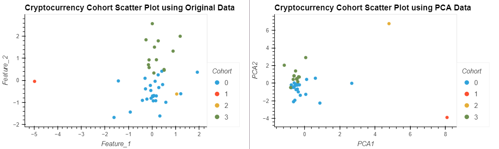

<h3>Unsupervised-Learning-Challenge</h3>

<h5>Code Location and Related</h5>

> The Unsupervised-Learning-Challenge skeletal program can be found by selecting the "Crypto_Clustering.ipynb" file
>

<h5>Modules Utilized</h5>

> Python (pandas, hvplot), scikit-learn (sklearn.cluster.KMeans, sklearn.decomposition.PCA, sklearn.preprocessing.StandardScaler)
> 

<h5>Code source and Usage:</h5>

> Credit: Tasha Christensen
>
> Usage: Educational purposes only
>
> Data for this dataset was generated by edX Boot Camps LLC
> 

<h5>Features and Tests</h5>

> When ran, Unsupervised-Learning-Challenge provides a visual example of the benefits of transforming your data using PCA
> 

<h5>Contact:</h5>

If there are any questions or concerns, I can be reached at:
> [github: elasmo4](https://github.com/elasmo4)
>
> [email: tasha.christensen44@gmail.com](mailto:tasha.christensen44@gmail.com)
